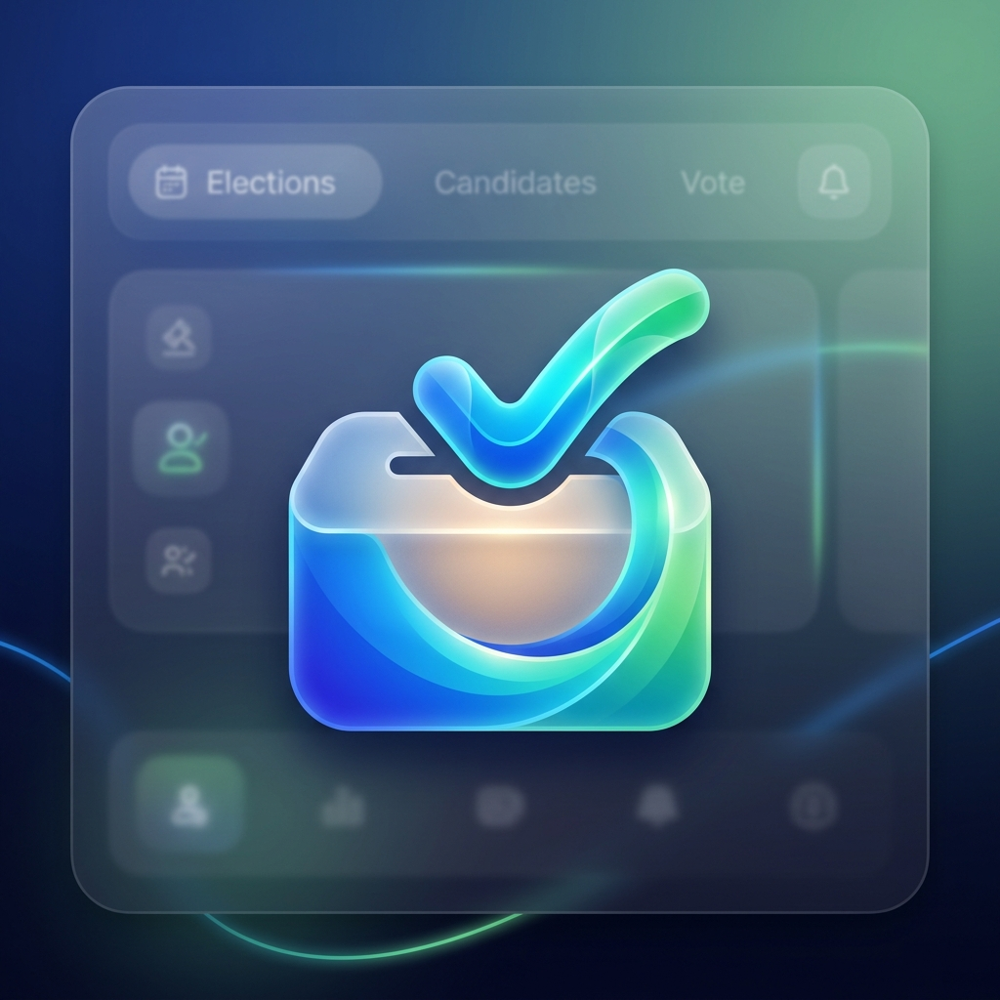
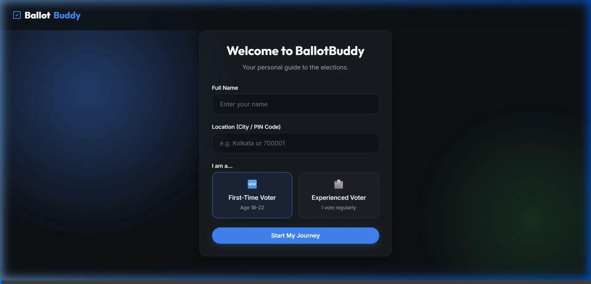
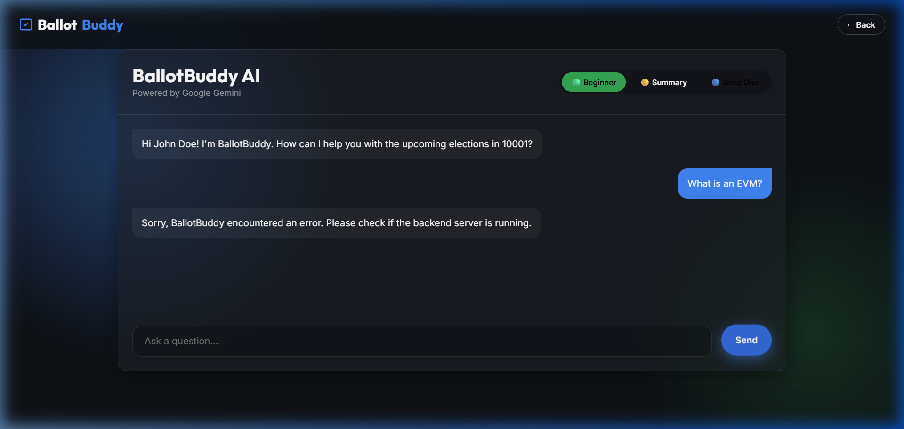
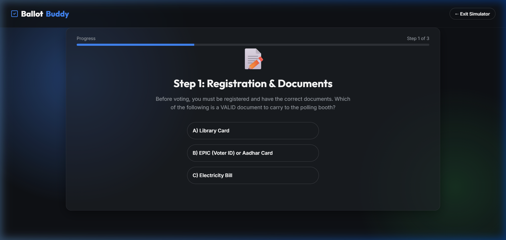

<div align="center">
  
  <h1>BallotBuddy</h1>
  <p><strong>Your Persona-Driven, AI-Powered Election Awareness Platform</strong></p>
  <p><i>Submission for the Google for Developers Virtual PromptWar Challenge</i></p>
</div>

---

## 🌟 Overview
**BallotBuddy** is a modern, responsive web application designed to empower voters through a gamified, personalized, and deeply insightful experience. Whether you are an anxious 18-year-old First-Time Voter or an Experienced Voter looking for in-depth candidate statistics, BallotBuddy adapts its UI and AI responses perfectly to your needs.

## 🚀 Live Demo & Deployment
You can access the fully functional, live application here:
**🔗 [BallotBuddy Live Demo](https://ballotbuddy-369865779033.us-central1.run.app)**

### Demo Media
#### Application Walkthrough
<div align="center">
  
</div>

#### Screenshots
<div style="display: flex; gap: 10px; justify-content: center;">
  
  
</div>

---

## 🏗️ System Architecture
BallotBuddy leverages a robust, secure, and highly scalable Full-Stack Architecture ensuring that API keys remain protected while delivering lightning-fast AI responses.

### Flowchart
```text
[ Client Browser (Vite / Vanilla JS) ]
       │          │
       │ (HTTP)   │ (WebSocket / Fetch)
       ▼          ▼
[ Express Node.js Backend Proxy (Port 3000) ]
       │
       │ (Secure Server-to-Server API Call)
       ▼
[ Google Cloud / Gemini API (Gemini 1.5 Flash) ]
```

1. **Frontend (Client Layer)**: Handles the beautiful Glassmorphism UI, DOM manipulation, state management (e.g., candidate selection comparison), and the gamified Election Simulator flow.
2. **Backend Proxy (Security Layer)**: A Node.js Express server that receives requests from the frontend, injects the `VITE_GEMINI_API_KEY` securely from the environment, and formulates the prompt.
3. **AI Layer (Google Tech Stack)**: Google's `@google/generative-ai` SDK interfaces with the **Gemini 1.5 Flash** model for high-speed, dynamic content generation.

---

## 🛠️ Technology Stack

### Google Technologies 🔵
- **Google Gemini 1.5 Flash**: The core AI engine powering both the dynamic *Candidate Summary Profiles* and the *BallotBuddy Chat Assistant*.
- **Google AI JavaScript SDK (`@google/generative-ai`)**: Used on the backend to interface seamlessly with the Gemini models.
- **Google Cloud Run (Ready)**: The architecture is fully Dockerized and optimized for serverless container deployment via Google Cloud Run.

### Frontend 🎨
- **Vite**: Next-generation frontend tooling for ultra-fast compilation and HMR.
- **Vanilla JavaScript (ES6+)**: Pure, dependency-free DOM manipulation and state logic.
- **Custom CSS3 (Glassmorphism)**: Advanced backdrop filters, CSS grids, and smooth micro-animations.

### Backend ⚙️
- **Node.js & Express**: Lightweight API routing and static file serving.
- **CORS & Dotenv**: Security and environment variable management.

---

## ✨ Key Features
1. **Persona-Driven Dynamic UI**: The app completely changes its tone and AI context based on whether the user identifies as a *First-Time Voter* or an *Experienced Voter*.
2. **AI Candidate Profiling**: Select a candidate and let Gemini 1.5 Flash instantly generate a creative, elaborately detailed backstory and performance analysis based on mock JSON data.
3. **Quick Comparison System**: Select exactly two candidates to trigger a beautiful, side-by-side tabular comparison of their metrics (Education, Assets, Criminal Records, etc.).
4. **Gamified Election Simulator**: A 3-step interactive journey that walks first-time voters through Registration, the Polling Booth, and EVM operation, culminating in an unlockable "Informed Citizen" badge!
5. **Context-Aware AI Assistant**: A dedicated chat widget that understands your persona (Beginner, Summary, Deep-Dive) and answers any election-related questions instantly.

---

## 💻 Local Development Setup

To run BallotBuddy locally on your machine:

1. **Clone the repository**:
   ```bash
   git clone https://github.com/pratyush06-aec/Virtual-PromptWar-2.git
   cd Virtual-PromptWar-2
   ```

2. **Install Dependencies**:
   ```bash
   npm install
   ```

3. **Environment Setup**:
   Create a `.env` file in the root directory and add your Gemini API Key:
   ```env
   VITE_GEMINI_API_KEY=your_gemini_api_key_here
   ```

4. **Start the Unified Server**:
   First, build the frontend, then start the Express server which serves both the API and the UI!
   ```bash
   npm run build
   node server.js
   ```
   *Navigate to `http://localhost:3000` in your browser.*

---

## ☁️ Cloud Run Deployment
The project is fully Dockerized. To deploy it to your GCP Project (`nexus-venue-190880`), run the following command to deploy directly from source:

```bash
gcloud run deploy ballotbuddy --source . --project nexus-venue-190880 --region us-central1 --allow-unauthenticated --set-env-vars="VITE_GEMINI_API_KEY=your_gemini_api_key_here"
```

---
*Built with ❤️ for the Google for Developers Virtual PromptWar Challenge.*
